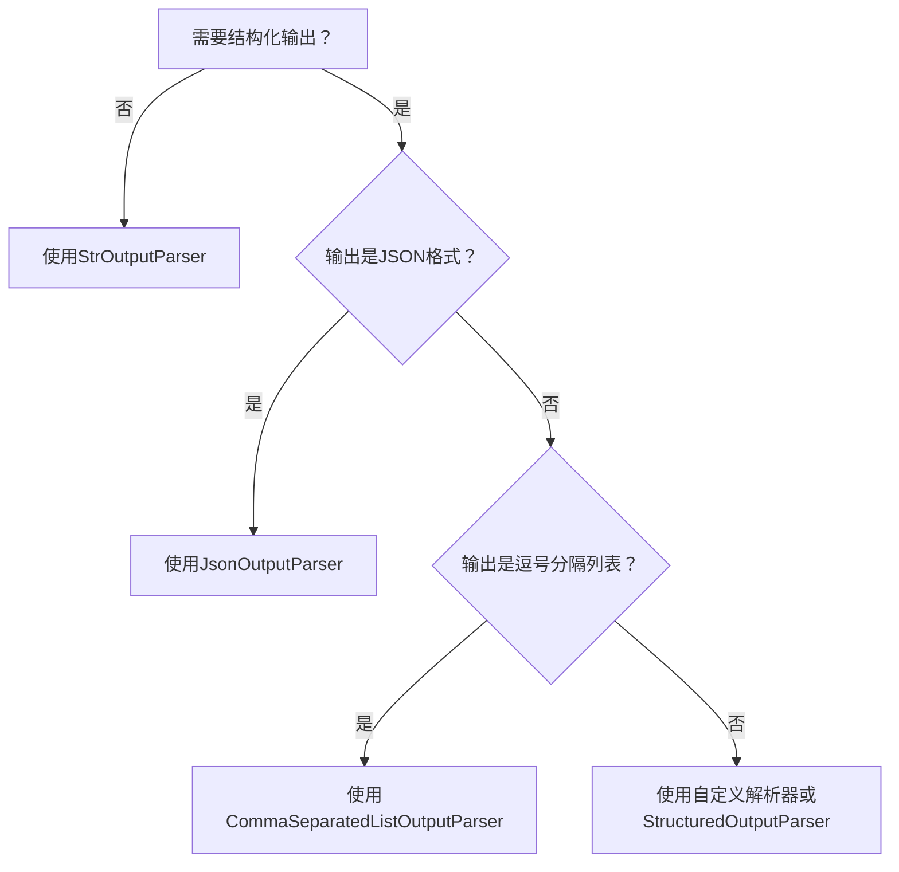

# LangChain 1.0 核心组件详解与最佳实践:模型初始化，提示模板，输出解析器

LangChain是一个强大的框架，用于构建基于大语言模型（LLM）的应用程序。本文将从**模型初始化**、**提示模板**和**输出解析器**三个核心组件入手，深入剖析LangChain 1.0的使用方法，帮助开发者快速掌握最佳实践。

## 一、模型初始化

LangChain支持多种LLM提供商的集成，初始化方式各有特点。通过对比不同方法，开发者可以选择最适合项目需求的方案。

### 1.1 模型初始化方法对比


| 方法              | 适用场景                           | 灵活性     | 代码简洁性 | 特点                                           |
| ----------------- | ---------------------------------- | ---------- | ---------- | ---------------------------------------------- |
| `init_chat_model` | 需要快速切换不同提供商模型         | ★★★★☆ | ★★★★☆ | 通用接口，支持多种提供商，但当前不支持通义千问 |
| `ChatOpenAI`      | 兼容OpenAI API的模型(包括通义千问) | ★★★★☆ | ★★★☆☆ | 标准化接口，适合熟悉OpenAI API的开发者         |
| 原生OpenAI客户端  | 需要深度控制API调用参数            | ★★★★★ | ★★☆☆☆ | 最底层控制，但失去LangChain抽象优势            |
| `ChatTongyi`      | 专门使用通义千问模型               | ★★☆☆☆ | ★★★★★ | 最简洁，针对阿里云生态优化                     |

### 1.2 推荐初始化方式

```python
# 最佳实践：使用ChatTongyi初始化通义千问
from langchain_community.chat_models import ChatTongyi

model = ChatTongyi(
    model_name="qwen-max",  # 指定模型版本
    temperature=0.7,        # 控制输出随机性
    max_tokens=2000         # 限制返回内容长度
)
```

**推荐理由**：

- 专为通义千问优化，接口简洁
- 保持与LangChain生态的兼容性
- 不需要手动处理API密钥（自动从环境变量读取）
- 支持所有通义千问特有的参数配置

### 1.3 其他提供商初始化示例

```python
# OpenAI模型
from langchain_openai import ChatOpenAI
openai_model = ChatOpenAI(model="gpt-4", api_key="your_key")

# 通义千问通过OpenAI兼容接口
qwen_via_openai = ChatOpenAI(
    model="qwen-max",
    api_key=os.getenv("ALI_TONGYI_API_KEY"),
    base_url="https://dashscope.aliyuncs.com/v1"
)
```

## 二、提示模板（Prompt Templates）

提示模板是LangChain的核心组件，用于结构化与LLM的交互，提高提示工程的可维护性和复用性。

### 2.1 基础提示模板（PromptTemplate）

适合简单场景，单轮对话：

```python
from langchain_core.prompts import PromptTemplate

# 基本用法
prompt = PromptTemplate.from_template(
    "你是一个{role}，请将以下内容翻译成{language}：{text}"
)
formatted_prompt = prompt.format(
    role="翻译助手",
    language="中文",
    text="I am a programmer"
)
```

**优势**：简单直接，学习曲线平缓
**局限**：不支持多轮对话上下文

### 2.2 聊天提示模板（ChatPromptTemplate）

支持多轮对话，保留对话历史：

```python
from langchain_core.prompts import ChatPromptTemplate

# 推荐的元组形式（最简洁）
prompt = ChatPromptTemplate.from_messages([
    ("system", "你是一个{role}，请将以下内容翻译成{language}"),
    ("human", "{text}"),
    ("ai", "{translation}")
])

# 格式化消息（返回Message对象列表，而非字符串）
messages = prompt.format_messages(
    role="翻译助手",
    language="中文",
    text="I am a programmer",
    translation="我是一个程序员"
)
```

**优势**：

- 保留对话角色结构
- 支持多轮对话上下文
- 与大多数聊天模型API兼容
- 可直接传入模型的invoke方法

### 2.3 少样本提示模板（FewShotPromptTemplate）

通过示例引导模型学习特定任务：

```python
from langchain_core.prompts import FewShotPromptTemplate, PromptTemplate

# 定义示例
examples = [
    {"input": "如何重置密码？", "output": "可以通过绑定邮箱或手机号重置密码"},
    {"input": "设备无法开机怎么办？", "output": "请检查电源连接、电池状态和锁屏设置"}
]

# 创建示例格式模板
example_prompt = PromptTemplate.from_template("问题：{input}\n回答：{output}")

# 创建少样本模板
few_shot_prompt = FewShotPromptTemplate(
    examples=examples,
    example_prompt=example_prompt,
    prefix="你是一个智能客服，根据以下示例回答用户问题：",
    suffix="问题：{input}\n回答：",
    input_variables=["input"]
)
```

**适用场景**：

- 需要模型遵循特定格式或风格
- 复杂任务需要示范
- 提高模型在专业领域的表现
- 减少幻觉，增强事实准确性

### 2.4 模板选择指南


| 模板类型                | 适用场景               | 复杂度     | 示例代码文件            |
| ----------------------- | ---------------------- | ---------- | ----------------------- |
| `PromptTemplate`        | 简单单轮任务           | ★☆☆☆☆ | `get_prompt_example1/2` |
| `ChatPromptTemplate`    | 多轮对话、角色扮演     | ★★☆☆☆ | `get_prompt_example3-6` |
| `FewShotPromptTemplate` | 需要示例引导的复杂任务 | ★★★★☆ | `get_prompt_example7`   |

## 三、输出解析器（Output Parsers）

输出解析器负责将LLM的文本响应转换为结构化数据，简化后续处理逻辑。

### 3.1 常见输出解析器类型

#### 3.1.1 字符串解析器（StrOutputParser）

最基础的解析器，将模型输出转换为纯字符串：

```python
from langchain_core.output_parsers import StrOutputParser

parser = StrOutputParser()
result = parser.parse(model_response.content)  # 返回纯字符串
```

**适用场景**：简单问答、文本生成、摘要等不需要结构化输出的场景

#### 3.1.2 JSON解析器（JsonOutputParser）

将模型输出解析为Python字典：

```python
from langchain_core.output_parsers import JsonOutputParser

parser = JsonOutputParser()
result = parser.parse(model_response.content)  # 返回字典对象
```

**增强用法**：结合Pydantic模型确保结构和类型安全

```python
from langchain_core.pydantic_v1 import BaseModel, Field
from langchain_core.output_parsers import JsonOutputParser

class Translation(BaseModel):
    source_text: str = Field(description="原文")
    target_language: str = Field(description="目标语言")
    translated_text: str = Field(description="翻译结果")

parser = JsonOutputParser(pydantic_object=Translation)
```

#### 3.1.3 列表解析器（CommaSeparatedListOutputParser）

将逗号分隔的文本转换为Python列表：

```python
from langchain_core.output_parsers import CommaSeparatedListOutputParser

parser = CommaSeparatedListOutputParser()
result = parser.parse("苹果, 香蕉, 橙子")  # 返回['苹果', '香蕉', '橙子']
```

**适用场景**：关键词提取、分类标签、枚举值等场景

### 3.2 高级解析器

除了基础解析器，LangChain还提供多种高级解析器：

```python
# 固定格式解析器
from langchain_core.output_parsers import ResponseSchema, StructuredOutputParser

response_schemas = [
    ResponseSchema(name="answer", description="问题的答案"),
    ResponseSchema(name="source", description="答案来源")
]
parser = StructuredOutputParser.from_response_schemas(response_schemas)

# 自定义解析器
class CustomParser(BaseOutputParser):
    def parse(self, text: str) -> Any:
        # 自定义解析逻辑
        return processed_result
```

### 3.3 解析器选择决策树



## 四、完整工作流示例

将三个核心组件整合为完整工作流：

```python
from langchain_community.chat_models import ChatTongyi
from langchain_core.prompts import ChatPromptTemplate
from langchain_core.output_parsers import JsonOutputParser
from langchain_core.pydantic_v1 import BaseModel, Field

# 1. 定义输出结构
class TranslationResult(BaseModel):
    source_language: str = Field(description="源语言")
    target_language: str = Field(description="目标语言")
    original_text: str = Field(description="原文")
    translated_text: str = Field(description="翻译结果")

# 2. 初始化模型
model = ChatTongyi(model_name="qwen-max")

# 3. 创建提示模板
prompt = ChatPromptTemplate.from_messages([
    ("system", "你是一个专业翻译助手，将{source_language}内容翻译成{target_language}，并以JSON格式返回结果。"),
    ("human", "需要翻译的内容：{text}")
])

# 4. 创建输出解析器
parser = JsonOutputParser(pydantic_object=TranslationResult)

# 5. 构建完整链
chain = prompt | model | parser

# 6. 执行并获取结构化结果
result = chain.invoke({
    "source_language": "英语",
    "target_language": "中文",
    "text": "Artificial intelligence is transforming our world."
})

print(result)
# 输出: {
#   "source_language": "英语",
#   "target_language": "中文", 
#   "original_text": "Artificial intelligence is transforming our world.",
#   "translated_text": "人工智能正在改变我们的世界。"
# }
```

## 五、最佳实践与建议

### 5.1 模型初始化最佳实践

1. **环境变量管理**：将API密钥存储在环境变量中，而非硬编码

   ```python
   import os
   api_key = os.getenv("ALI_TONGYI_API_KEY")
   ```
2. **参数配置分离**：将模型参数集中管理，提高代码可维护性

   ```python
   MODEL_CONFIG = {
       "model_name": "qwen-max",
       "temperature": 0.3,
       "max_tokens": 2000,
       "top_p": 0.8
   }
   model = ChatTongyi(**MODEL_CONFIG)
   ```

### 5.2 提示工程最佳实践

1. **角色明确**：在系统消息中明确定义AI角色

   ```python
   ("system", "你是一位经验丰富的Python开发工程师，擅长解释复杂概念。")
   ```
2. **结构化指令**：使用步骤化指令提高准确性

   ```python
   template = """
   请按以下步骤回答问题：
   1. 理解用户问题的核心
   2. 提取关键信息
   3. 组织简洁明了的回答
   4. 验证回答的准确性

   问题：{question}
   """
   ```
3. **少样本学习**：为复杂任务提供2-3个高质量示例

   ```python
   # 优质示例应涵盖边界情况和常规情况
   examples = [
       {"input": "紧急问题：服务器宕机", "output": "【紧急】已通知运维团队，预计15分钟内恢复"},
       {"input": "如何查看账户余额？", "output": "您可以在APP首页点击'我的账户'查看实时余额。"}
   ]
   ```

### 5.3 输出处理最佳实践

1. **验证与错误处理**：始终添加输出验证和异常处理

   ```python
   try:
       result = parser.parse(model_response.content)
   except OutputParserException as e:
       # 处理解析失败，可能需要重新请求或提供默认值
       result = handle_parsing_error(e, model_response)
   ```
2. **链式处理**：使用LangChain表达式语言(LCEL)构建处理链

   ```python
   from langchain_core.runnables import RunnableLambda

   def validate_translation(data):
       if not data.get("translated_text"):
           raise ValueError("翻译结果为空")
       return data

   chain = prompt | model | parser | RunnableLambda(validate_translation)
   ```

## 六、进阶应用场景

### 6.1 动态提示模板

根据上下文动态调整提示内容：

```python
def get_role_specific_prompt(user_role):
    role_instructions = {
        "admin": "你拥有系统完全访问权限，可以执行所有操作",
        "user": "你只能查询信息，不能修改系统配置",
        "guest": "你只能查看公开信息"
    }
  
    return ChatPromptTemplate.from_messages([
        ("system", f"当前用户角色：{user_role}\n{role_instructions.get(user_role, '')}"),
        ("human", "{query}")
    ])
```

### 6.2 多模态输出解析

处理包含多种数据类型的复杂输出：

```python
class MultiModalResponse(BaseModel):
    text: str = Field(description="文字回复")
    code: Optional[str] = Field(description="如有代码示例，提供代码")
    image_description: Optional[str] = Field(description="如需图片，提供图片描述")
    references: List[str] = Field(description="相关参考资料")
```

### 6.3 模型路由策略

根据任务类型动态选择不同模型：

```python
def get_optimal_model(task_type):
    """根据任务类型返回最适合的模型"""
    model_mapping = {
        "creative_writing": ChatTongyi(model_name="qwen-max"),
        "factual_qa": ChatTongyi(model_name="qwen-plus"),
        "code_generation": ChatTongyi(model_name="qwen-coder")
    }
    return model_mapping.get(task_type, ChatTongyi(model_name="qwen-turbo"))
```

## 结语

LangChain 1.0通过**模型初始化**、**提示模板**和**输出解析器**三大核心组件，为开发者提供了构建LLM应用的强大工具集。掌握这些组件的正确使用方法，能够显著提升开发效率和应用质量。

在实际应用中，建议：

1. 从简单组件开始，逐步引入复杂功能
2. 保持提示模板与业务逻辑分离
3. 为输出解析添加健壮的错误处理
4. 使用LCEL构建可组合、可测试的处理链

LangChain生态持续演进，建议开发者关注官方文档更新，及时采用最新最佳实践，构建更加智能、可靠的语言模型应用。
